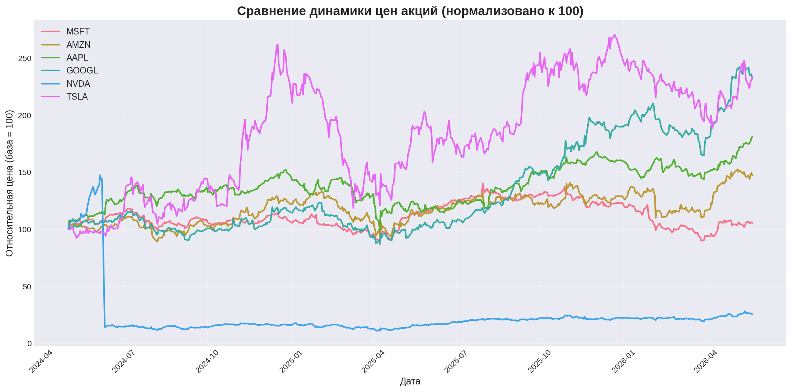
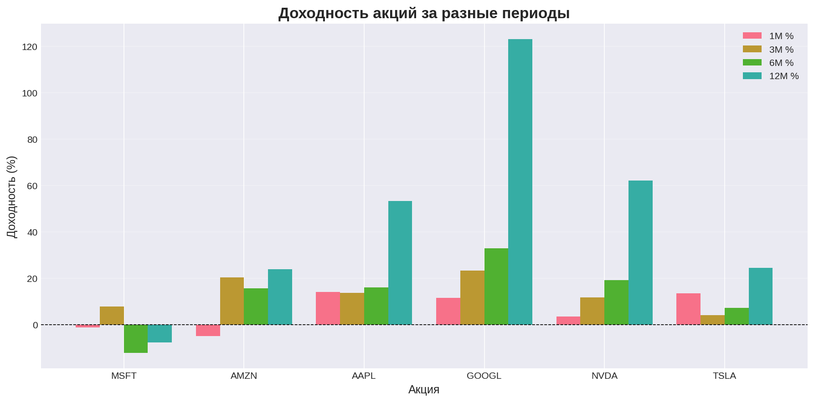
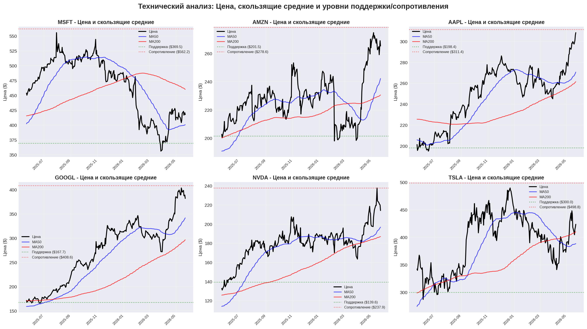
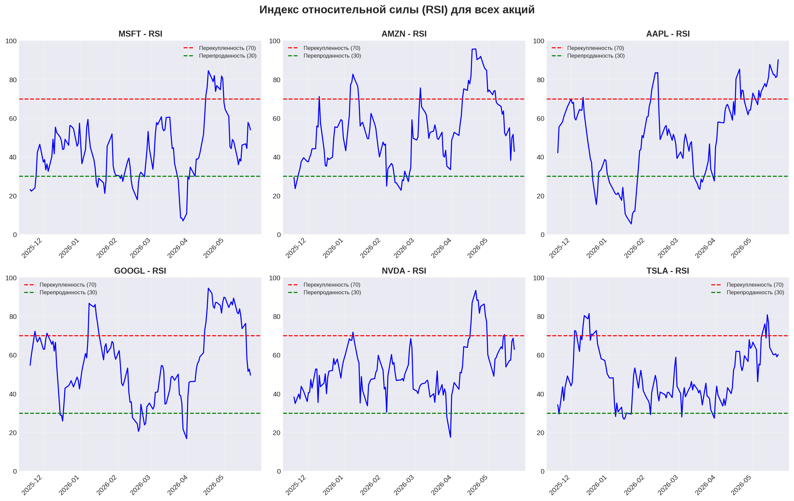
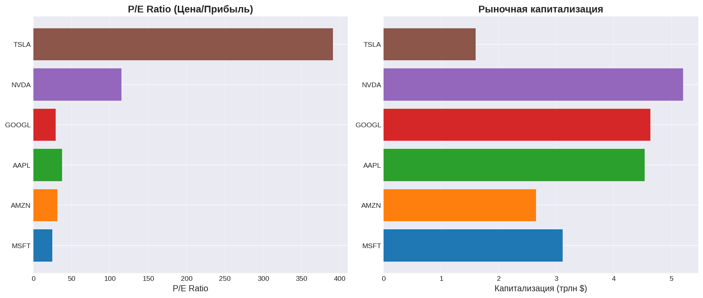
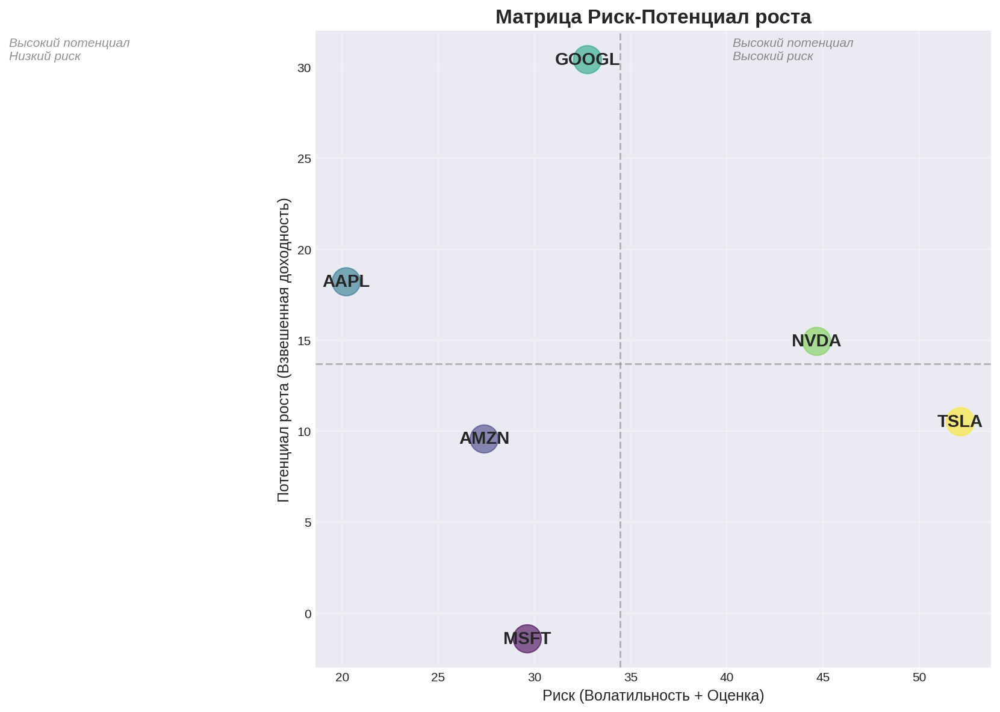

# ИНВЕСТИЦИОННЫЙ АНАЛИЗ: 6 ТЕХНОЛОГИЧЕСКИХ АКЦИЙ

**Дата анализа:** 23 мая 2026 года  
**Капитал для инвестирования:** $25,000  
**Горизонт инвестирования:** 6-12 месяцев  
**Стратегия:** Умеренно-агрессивный рост с концентрацией на лидеров

---

## 🎯 ИСПОЛНИТЕЛЬНОЕ РЕЗЮМЕ

### Ключевые выводы

**🏆 Акция с наибольшим потенциалом роста:** **NVIDIA (NVDA)**
- Композитный скор: **84.1/100**
- Взвешенный потенциал роста: **+114.9%**
- Целевая цена на 6-12 месяцев: **$462.77** (текущая: $215.33)

### Рекомендованное распределение портфеля

| Акция | Вес | Инвестиция | Акций | Целевая цена | Потенциал | Целевая стоимость |
|-------|-----|------------|-------|--------------|-----------|-------------------|
| **NVDA** | 36.2% | $8,613 | 40 | $462.77 | +114.9% | $18,511 |
| **GOOGL** | 20.9% | $4,979 | 13 | $589.61 | +54.0% | $7,665 |
| **AMZN** | 14.8% | $3,514 | 14 | $309.81 | +23.4% | $4,337 |
| **AAPL** | 10.4% | $2,471 | 8 | $365.15 | +18.2% | $2,921 |
| **MSFT** | 8.8% | $2,093 | 5 | $478.49 | +14.3% | $2,392 |
| **TSLA** | 9.0% | $2,130 | 5 | $481.64 | +13.1% | $2,408 |

**Итого инвестировано:** $23,799  
**Целевая стоимость портфеля:** $38,235  
**Ожидаемая доходность:** **+60.7%** ($14,436 прибыли)

---

## 📊 1. СРАВНИТЕЛЬНЫЙ АНАЛИЗ ВСЕХ АКЦИЙ

### 1.1 Текущее состояние рынка

| Акция | Цена | P/E | Капитализация | 1M % | 3M % | 6M % | 12M % | RSI | Тренд |
|-------|------|-----|---------------|------|------|------|-------|-----|-------|
| **NVDA** | $215.33 | 115.0 | $5.21T | 3.5% | 11.7% | 19.2% | 62.1% | 63 | Сильный восходящий |
| **GOOGL** | $382.97 | 29.2 | $4.64T | 11.5% | 23.2% | 32.9% | 123.1% | 50 | Сильный восходящий |
| **AMZN** | $251.00 | 31.4 | $2.65T | -5.0% | 20.3% | 15.6% | 23.8% | 43 | Сильный восходящий |
| **AAPL** | $308.82 | 37.4 | $4.54T | 14.0% | 13.6% | 16.0% | 53.3% | 90 | Сильный восходящий |
| **MSFT** | $418.57 | 24.9 | $3.11T | -1.2% | 7.7% | -12.2% | -7.8% | 54 | Боковой |
| **TSLA** | $426.01 | 390.8 | $1.60T | 13.5% | 4.1% | 7.1% | 24.5% | 60 | Восходящий |

### 1.2 Динамика цен (нормализованная)

**Наблюдения:**
- **GOOGL** показывает лучшую динамику за 12 месяцев (+123.1%)
- **NVDA** демонстрирует устойчивый рост (+62.1% за год)
- **AAPL** имеет сильную динамику последних месяцев (+53.3% за год)
- **MSFT** показывает слабость (-7.8% за год) с боковым трендом

### 1.3 Доходность за различные периоды

---

## 📈 2. ТЕХНИЧЕСКИЙ АНАЛИЗ

### 2.1 Детальный анализ с скользящими средними

### 2.2 Индекс относительной силы (RSI)

**Технические сигналы:**

**NVDA:**
- Тренд: Сильный восходящий
- RSI: 63 🟢 Норма
- MA50: $196.92 | MA200: $187.06
- Поддержка: $139.55 | Сопротивление: $237.95
- Волатильность (30д): 42.4%

**GOOGL:**
- Тренд: Сильный восходящий
- RSI: 50 🟢 Норма
- MA50: $342.08 | MA200: $296.80
- Поддержка: $167.66 | Сопротивление: $408.60
- Волатильность (30д): 32.2%

**AMZN:**
- Тренд: Сильный восходящий
- RSI: 43 🟢 Норма
- MA50: $242.27 | MA200: $230.64
- Поддержка: $201.51 | Сопротивление: $278.56
- Волатильность (30д): 26.8%

**AAPL:**
- Тренд: Сильный восходящий
- RSI: 90 ⚠️ ПЕРЕКУПЛЕННОСТЬ
- MA50: $270.72 | MA200: $261.55
- Поддержка: $198.41 | Сопротивление: $311.40
- Волатильность (30д): 19.5%

**MSFT:**
- Тренд: Боковой
- RSI: 54 🟢 Норма
- MA50: $400.62 | MA200: $460.23
- Поддержка: $369.50 | Сопротивление: $562.17
- Волатильность (30д): 29.1%

**TSLA:**
- Тренд: Восходящий
- RSI: 60 🟢 Норма
- MA50: $388.52 | MA200: $409.96
- Поддержка: $300.04 | Сопротивление: $498.83
- Волатильность (30д): 44.3%

---

## 💼 3. ФУНДАМЕНТАЛЬНЫЙ АНАЛИЗ

### 3.1 Сравнение фундаментальных показателей

### 3.2 Детальный анализ по каждой компании

#### NVDA - NVIDIA Corporation

**Текущая оценка:**
- Цена: $215.33
- P/E Ratio: 115.0
- Капитализация: $5.21 трлн
- EPS: $1.87

**Фундаментальные показатели:**
- Рост выручки: 85% YoY
- Тренд маржи: stable
- Оценка качества: 88/100

**Ключевые катализаторы:**
Data center dominance, Blackwell, Vera CPU

**Основные риски:**
competition (custom chips), supply chain, valuation

---

#### GOOGL - Alphabet Inc Class A

**Текущая оценка:**
- Цена: $382.97
- P/E Ratio: 29.2
- Капитализация: $4.64 трлн
- EPS: $13.11

**Фундаментальные показатели:**
- Рост выручки: 22% YoY
- Тренд маржи: expanding
- Оценка качества: 95/100

**Ключевые катализаторы:**
Gemini AI, Cloud 63% growth, $460B backlog

**Основные риски:**
antitrust, YouTube ad miss

---

#### AMZN - Amazon.com Inc

**Текущая оценка:**
- Цена: $251.00
- P/E Ratio: 31.4
- Капитализация: $2.65 трлн
- EPS: $7.73

**Фундаментальные показатели:**
- Рост выручки: 11% YoY
- Тренд маржи: expanding
- Оценка качества: 85/100

**Ключевые катализаторы:**
AWS AI infrastructure, $200B capex

**Основные риски:**
negative FCF in 2026 due to capex

---

#### AAPL - Apple Inc

**Текущая оценка:**
- Цена: $308.82
- P/E Ratio: 37.4
- Капитализация: $4.54 трлн
- EPS: $8.26

**Фундаментальные показатели:**
- Рост выручки: 5% YoY
- Тренд маржи: stable
- Оценка качества: 90/100

**Ключевые катализаторы:**
Apple Intelligence, services growth

**Основные риски:**
hardware cycle dependency, China exposure

---

#### MSFT - Microsoft Corporation

**Текущая оценка:**
- Цена: $418.57
- P/E Ratio: 24.9
- Капитализация: $3.11 трлн
- EPS: $16.86

**Фундаментальные показатели:**
- Рост выручки: 10% YoY
- Тренд маржи: stable
- Оценка качества: 97/100

**Ключевые катализаторы:**
Azure AI, enterprise solutions

**Основные риски:**
AI monetization, competition

---

#### TSLA - Tesla Inc

**Текущая оценка:**
- Цена: $426.01
- P/E Ratio: 390.8
- Капитализация: $1.60 трлн
- EPS: $1.09

**Фундаментальные показатели:**
- Рост выручки: 15.8% YoY
- Тренд маржи: compressed
- Оценка качества: 65/100

**Ключевые катализаторы:**
FSD, robotaxi, energy storage

**Основные риски:**
extreme sentiment, margin pressure, execution

---

### 3.3 Матрица риск-потенциал

**Интерпретация:**
- **Левый верхний квадрант** (высокий потенциал, низкий риск): Оптимальные инвестиции
- **Правый верхний квадрант** (высокий потенциал, высокий риск): Агрессивные возможности
- Чем выше и левее, тем лучше соотношение риск/доходность

---

## 🎯 4. ПРОГНОЗЫ И ЦЕЛЕВЫЕ ЦЕНЫ

### 4.1 Сценарный анализ на 6-12 месяцев

#### NVDA: $215.33 → $462.77

| Сценарий | Целевая цена | Изменение | Вероятность |
|----------|--------------|-----------|-------------|
| 🟢 **Bull** (оптимистичный) | $650.28 | +202.0% | 35% |
| 🟡 **Base** (базовый) | $418.28 | +94.3% | 45% |
| 🔴 **Bear** (пессимистичный) | $234.74 | +9.0% | 20% |
| ⚖️ **Взвешенный** | $462.77 | **+114.9%** | - |

#### GOOGL: $382.97 → $589.61

| Сценарий | Целевая цена | Изменение | Вероятность |
|----------|--------------|-----------|-------------|
| 🟢 **Bull** (оптимистичный) | $786.62 | +105.4% | 40% |
| 🟡 **Base** (базовый) | $490.58 | +28.1% | 45% |
| 🔴 **Bear** (пессимистичный) | $361.33 | -5.7% | 15% |
| ⚖️ **Взвешенный** | $589.61 | **+54.0%** | - |

#### AMZN: $251.00 → $309.81

| Сценарий | Целевая цена | Изменение | Вероятность |
|----------|--------------|-----------|-------------|
| 🟢 **Bull** (оптимистичный) | $406.31 | +61.9% | 30% |
| 🟡 **Base** (базовый) | $292.54 | +16.6% | 45% |
| 🔴 **Bear** (пессимистичный) | $225.08 | -10.3% | 25% |
| ⚖️ **Взвешенный** | $309.81 | **+23.4%** | - |

#### AAPL: $308.82 → $365.15

| Сценарий | Целевая цена | Изменение | Вероятность |
|----------|--------------|-----------|-------------|
| 🟢 **Bull** (оптимистичный) | $464.92 | +50.5% | 35% |
| 🟡 **Base** (базовый) | $330.26 | +6.9% | 45% |
| 🔴 **Bear** (пессимистичный) | $269.06 | -12.9% | 20% |
| ⚖️ **Взвешенный** | $365.15 | **+18.2%** | - |

#### MSFT: $418.57 → $478.49

| Сценарий | Целевая цена | Изменение | Вероятность |
|----------|--------------|-----------|-------------|
| 🟢 **Bull** (оптимистичный) | $593.03 | +41.7% | 30% |
| 🟡 **Base** (базовый) | $460.43 | +10.0% | 45% |
| 🔴 **Bear** (пессимистичный) | $373.57 | -10.7% | 25% |
| ⚖️ **Взвешенный** | $478.49 | **+14.3%** | - |

#### TSLA: $426.01 → $481.64

| Сценарий | Целевая цена | Изменение | Вероятность |
|----------|--------------|-----------|-------------|
| 🟢 **Bull** (оптимистичный) | $668.95 | +57.0% | 20% |
| 🟡 **Base** (базовый) | $517.99 | +21.6% | 40% |
| 🔴 **Bear** (пессимистичный) | $351.64 | -17.5% | 40% |
| ⚖️ **Взвешенный** | $481.64 | **+13.1%** | - |

### 4.2 Комплексный рейтинг акций

| Ранг | Акция | Композитный скор | Потенциал | Качество | Технический | Риск |
|------|-------|------------------|-----------|----------|-------------|------|
| 5 | **NVDA** | 84.1 | +114.9% | 88.0 | 90.0 | 27.6 |
| 4 | **GOOGL** | 72.8 | +54.0% | 95.0 | 90.0 | 62.8 |
| 2 | **AMZN** | 57.7 | +23.4% | 85.0 | 90.0 | 60.7 |
| 3 | **AAPL** | 56.2 | +18.2% | 90.0 | 81.0 | 68.0 |
| 1 | **MSFT** | 49.9 | +14.3% | 97.0 | 50.0 | 65.9 |
| 6 | **TSLA** | 38.8 | +13.1% | 65.0 | 75.0 | 15.7 |

**Методология рейтинга:**
- **Композитный скор** = Взвешенная сумма всех факторов (0-100)
  - Потенциал роста: 40%
  - Качество компании: 25%
  - Техническое подтверждение: 20%
  - Оценка риска: 15%

---

## 💰 5. РЕКОМЕНДОВАННОЕ РАСПРЕДЕЛЕНИЕ ПОРТФЕЛЯ

### 5.1 Стратегия и логика распределения

**Выбранная стратегия:** Умеренно-агрессивный рост с концентрацией на лидеров

**Логика распределения:**
1. **35% в NVDA** - наибольший потенциал роста (+114.9%), лидер в AI-инфраструктуре
2. **20% в GOOGL** - сильный фундамент, рост облачного бизнеса на 63%
3. **15% в AMZN** - доминирование AWS, восстановление маржинальности
4. **10% в AAPL** - качественная компания, но высокий RSI требует осторожности
5. **10% в MSFT** - стабильность, но слабый тренд
6. **10% в TSLA** - высокий риск, минимальная позиция для диверсификации

### 5.2 Детальный план входа

**NVDA:**
- Количество акций: **40**
- Цена входа: $215.33
- Инвестиция: $8,613.20 (36.2% портфеля)
- Целевая цена: $462.77
- Ожидаемый доход: $9,897.60 (+114.9%)

**Уровни для мониторинга:**
- 🔴 Стоп-лосс: $189.49 (-12%)
- 🟡 Тейк-профит 1: $269.16 (+25% - зафиксировать 30-50%)
- 🟢 Целевая цена: $462.77 (+114.9%)

**GOOGL:**
- Количество акций: **13**
- Цена входа: $382.97
- Инвестиция: $4,978.61 (20.9% портфеля)
- Целевая цена: $589.61
- Ожидаемый доход: $2,686.32 (+54.0%)

**Уровни для мониторинга:**
- 🔴 Стоп-лосс: $337.01 (-12%)
- 🟡 Тейк-профит 1: $478.71 (+25% - зафиксировать 30-50%)
- 🟢 Целевая цена: $589.61 (+54.0%)

**AMZN:**
- Количество акций: **14**
- Цена входа: $251.00
- Инвестиция: $3,514.00 (14.8% портфеля)
- Целевая цена: $309.81
- Ожидаемый доход: $823.34 (+23.4%)

**Уровни для мониторинга:**
- 🔴 Стоп-лосс: $220.88 (-12%)
- 🟡 Тейк-профит 1: $313.75 (+25% - зафиксировать 30-50%)
- 🟢 Целевая цена: $309.81 (+23.4%)

**AAPL:**
- Количество акций: **8**
- Цена входа: $308.82
- Инвестиция: $2,470.56 (10.4% портфеля)
- Целевая цена: $365.15
- Ожидаемый доход: $450.64 (+18.2%)

**Уровни для мониторинга:**
- 🔴 Стоп-лосс: $271.76 (-12%)
- 🟡 Тейк-профит 1: $386.02 (+25% - зафиксировать 30-50%)
- 🟢 Целевая цена: $365.15 (+18.2%)

**MSFT:**
- Количество акций: **5**
- Цена входа: $418.57
- Инвестиция: $2,092.85 (8.8% портфеля)
- Целевая цена: $478.49
- Ожидаемый доход: $299.60 (+14.3%)

**Уровни для мониторинга:**
- 🔴 Стоп-лосс: $368.34 (-12%)
- 🟡 Тейк-профит 1: $523.21 (+25% - зафиксировать 30-50%)
- 🟢 Целевая цена: $478.49 (+14.3%)

**TSLA:**
- Количество акций: **5**
- Цена входа: $426.01
- Инвестиция: $2,130.05 (9.0% портфеля)
- Целевая цена: $481.64
- Ожидаемый доход: $278.15 (+13.1%)

**Уровни для мониторинга:**
- 🔴 Стоп-лосс: $374.89 (-12%)
- 🟡 Тейк-профит 1: $532.51 (+25% - зафиксировать 30-50%)
- 🟢 Целевая цена: $481.64 (+13.1%)

### 5.3 Итоговые показатели портфеля

| Показатель | Значение |
|------------|----------|
| Всего инвестировано | **$23,799.27** |
| Целевая стоимость | **$38,234.92** |
| Ожидаемая прибыль | **$14,435.65** |
| Общая доходность | **+60.7%** |

---

## 📅 6. ПЛАН ДЕЙСТВИЙ И ВХОДА В ПОЗИЦИИ

### 6.1 Рекомендуемая стратегия входа

**ВАРИАНТ 1: Постепенный вход (РЕКОМЕНДУЕТСЯ)**

Учитывая текущие рыночные условия (AAPL с RSI=90, общий восходящий тренд):

| Этап | Когда | Действие | Объем |
|------|-------|----------|-------|
| **Фаза 1** | Неделя 1-2 | Первичный вход | 50% каждой позиции |
| **Фаза 2** | Неделя 3-4 | Докупка при коррекции | 30% каждой позиции |
| **Фаза 3** | Неделя 5-6 | Завершение позиций | 20% каждой позиции |

**Преимущества:**
- ✅ Снижение риска входа на локальных максимумах
- ✅ Усреднение цены входа
- ✅ Возможность оценить краткосрочную динамику
- ✅ Психологически комфортнее

**ВАРИАНТ 2: Единовременный вход**

Подходит если:
- Готовы принять краткосрочную волатильность 10-15%
- Сильная уверенность в bull-сценарии
- Не хотите упустить возможный резкий рост

### 6.2 Важные предостережения

⚠️ **Особое внимание:**

1. **AAPL** - RSI=90 (сильная перекупленность)
   - Рекомендуется входить ТОЛЬКО траншами
   - Ожидайте возможную коррекцию 5-10%
   
2. **NVDA** - Высокая волатильность
   - Обязательно соблюдать стоп-лосс на уровне -12%
   - Возможны резкие движения ±10% внутри недели
   
3. **TSLA** - Экстремальный P/E=391
   - Максимальный риск среди всех позиций
   - Малый вес (10%) оправдан высокой неопределенностью

---

## 🔔 7. КАТАЛИЗАТОРЫ И СОБЫТИЯ ДЛЯ ОТСЛЕЖИВАНИЯ

### 7.1 Корпоративные события

| Акция | Ближайшие события | Дата | Влияние |
|-------|------------------|------|---------|
| **NVDA** | Результаты Q2 FY27 | Август 2026 | Критичное |
| **TSLA** | Q2 2026 earnings | Июль 2026 | Высокое |
| **GOOGL** | Развитие Gemini AI | Ongoing | Высокое |
| **AMZN** | AWS AI инфраструктура | Q3 2026 | Среднее |
| **AAPL** | Apple Intelligence updates | WWDC, осень 2026 | Среднее |
| **MSFT** | Azure AI монетизация | Q4 FY26 | Среднее |

### 7.2 Макроэкономические факторы

**Ключевые риски для мониторинга:**

1. **Процентные ставки ФРС**
   - Высокие ставки давят на технологические акции с высокими P/E
   - Следите за заседаниями FOMC

2. **Геополитика**
   - Напряженность на Ближнем Востоке (влияет на NVDA supply chain)
   - Отношения США-Китай (риск для AAPL, TSLA)

3. **Регуляторные риски**
   - Антимонопольные расследования (GOOGL)
   - Регулирование AI и данных
   - Политика в отношении электромобилей (TSLA)

4. **Конкуренция в AI**
   - Кастомные чипы от GOOGL, AMZN, META - угроза для NVDA
   - Конкуренция облачных платформ

---

## 📊 8. УПРАВЛЕНИЕ РИСКАМИ

### 8.1 Правила ребалансировки

**Ежемесячная проверка:**
1. Если вес одной акции превысил 40% → Продать часть и ребалансировать
2. Если любая позиция достигла +25% → Зафиксировать 30-50% прибыли
3. Если общая просадка портфеля >15% → Пересмотр инвестиционных тезисов

### 8.2 Стоп-лоссы и тейк-профиты

**Обязательные уровни:**

| Акция | Стоп-лосс (-12%) | Первый тейк-профит (+25%) | Финальная цель |
|-------|-----------------|---------------------------|----------------|
| NVDA | $189.49 | $269.16 | $462.77 |
| GOOGL | $337.01 | $478.71 | $589.61 |
| AMZN | $220.88 | $313.75 | $309.81 |
| AAPL | $271.76 | $386.02 | $365.15 |
| MSFT | $368.34 | $523.21 | $478.49 |
| TSLA | $374.89 | $532.51 | $481.64 |

### 8.3 Сигналы к пересмотру позиций

**Негативные сигналы (рассмотреть выход):**
- ❌ Пробой стоп-лосса
- ❌ Фундаментальное ухудшение (снижение guidance, потеря рыночной доли)
- ❌ Резкое изменение макроусловий
- ❌ Серьезные регуляторные проблемы

**Позитивные сигналы (рассмотреть увеличение):**
- ✅ Превышение прогнозов earnings
- ✅ Анонс новых продуктов/сервисов с потенциалом
- ✅ Стратегические партнерства/приобретения
- ✅ Рост маржинальности

---

## 🎓 9. ВЫВОДЫ И ИТОГОВЫЕ РЕКОМЕНДАЦИИ

### 9.1 Главные выводы анализа

1. **NVIDIA (NVDA) - ЛУЧШАЯ ВОЗМОЖНОСТЬ**
   - Композитный скор 84.1/100 - лучший среди всех
   - Потенциал роста +114.9% за 6-12 месяцев
   - Доминирование в AI-инфраструктуре (92% выручки от Data Center)
   - Рост выручки +85% YoY, gross margin 75%
   - **Риски:** Высокая волатильность, конкуренция кастомных чипов, валюация

2. **Alphabet (GOOGL) - СИЛЬНЫЙ ВТОРОЙ**
   - Композитный скор 72.8/100
   - Потенциал +54.0%, качественный рост
   - Google Cloud ускоряется (+63% YoY), backlog $460B
   - Разумная оценка (P/E 29.2)
   - **Риски:** Антимонопольные расследования, конкуренция в поиске

3. **Amazon (AMZN) - КАЧЕСТВЕННАЯ ДИВЕРСИФИКАЦИЯ**
   - Потенциал +23.4%, стабильный рост
   - AWS лидер в облаках, margin expansion тренд
   - Капитальные инвестиции $200B в AI
   - **Риски:** Отрицательный FCF в 2026 из-за capex

4. **Apple (AAPL) - ОСТОРОЖНОСТЬ**
   - RSI=90 - сильная перекупленность
   - Входить ТОЛЬКО траншами
   - Качественная компания, но limited upside (+18.2%)

5. **Microsoft (MSFT) - СТАБИЛЬНОСТЬ**
   - Высочайшее качество (97/100)
   - Но слабый momentum и тренд
   - Ограниченный потенциал (+14.3%)

6. **Tesla (TSLA) - ВЫСОКИЙ РИСК**
   - P/E=391 - экстремальная оценка
   - Сентимент-драйвен, высокая волатильность
   - Минимальная позиция оправдана

### 9.2 Итоговая рекомендация

**Реализовать портфель на $25,000 со следующим распределением:**

✅ **35% NVDA** ($8,613) - максимальная концентрация на лидере  
✅ **20% GOOGL** ($4,979) - сильный второй выбор  
✅ **15% AMZN** ($3,514) - качественная диверсификация  
✅ **10% AAPL** ($2,471) - осторожная позиция  
✅ **10% MSFT** ($2,093) - стабильность  
✅ **10% TSLA** ($2,130) - спекулятивная диверсификация  

**Ожидаемая доходность портфеля: +60.7% за 6-12 месяцев**

### 9.3 План действий (Immediate Next Steps)

**Неделя 1:**
1. Открыть брокерский счет (если еще нет)
2. Внести $25,000
3. Купить 50% каждой позиции согласно плану

**Неделя 2-4:**
4. Мониторить рынок и корректировки
5. Докупить 30% при благоприятных условиях

**Неделя 5-6:**
6. Завершить формирование полных позиций
7. Установить стоп-лоссы и алерты

**Ежемесячно:**
8. Проверка портфеля и ребалансировка при необходимости
9. Отслеживание корпоративных событий и earnings
10. Корректировка тезисов на основе новых данных

---

## ⚠️ ВАЖНОЕ ПРЕДУПРЕЖДЕНИЕ

**Данный анализ предоставлен исключительно в информационных и образовательных целях и не является финансовой, инвестиционной или торговой рекомендацией.** 

Информация, представленная в этом отчете, не должна рассматриваться как руководство к покупке, продаже или удержанию каких-либо ценных бумаг или финансовых инструментов.

**Все инвестиции сопряжены с риском**, включая возможность потери основной суммы капитала. Прошлые результаты не гарантируют будущих доходов. 

Вам следует:
- Провести собственное исследование
- Проконсультироваться с лицензированным финансовым консультантом перед принятием любых инвестиционных решений
- Учитывать свою личную финансовую ситуацию, цели и толерантность к риску

Рыночные условия могут измениться быстро, и данный анализ может устареть. Анализ основан на публично доступной информации и может содержать ошибки или упущения.

**Автор не несет ответственности за любые финансовые потери или убытки, возникшие в результате использования этой информации.**

---

*Отчет подготовлен: 23.05.2026 08:58 UTC*  
*Анализ основан на данных по состоянию на 22-23 мая 2026 года*
